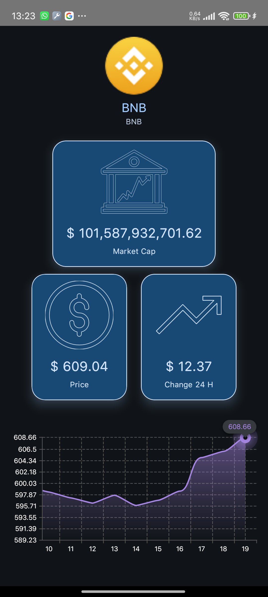

<br>

# CryptoList - Kotlin Android App


CryptoList is a simple Android application that provides a clean, user-friendly interface to browse
a list of cryptocurrencies with basic details for each. This app is built using **Kotlin** and
follows the principles of **Clean Architecture**, allowing for scalable, testable, and maintainable
code. It's designed with the future in mind as I expand my skills in Android development.

## Features

- Browse a list of popular cryptocurrencies.
- View detailed information for each cryptocurrency.
- Clean, intuitive user interface.

## Tech Stack

- **Kotlin**: The primary language for development.
- **Clean Architecture**: Ensures a clear separation of concerns and easier testing/maintenance.
- **Coroutines**: For managing asynchronous tasks.
- **Ktor**: To fetch data from cryptocurrency APIs.
- **Adaptive Navigation**: For screen naviation.
- **Koin**: For dependency injection.
- **Jetpack Compose**: ...

## Motivation

I created CryptoList as a learning project to further develop my skills in **Kotlin**, **Clean
Architecture**, and Android best practices. My aim is to create a modular, maintainable,
implementing industry-standard tools and techniques.

## Screenshots

<!-- Include some screenshots of the app in action -->

- Main list of cryptocurrencies
- Cryptocurrency details screen

## Installation

To run this project locally, you will need to:

1. Clone this repository.
    ```
    git clone https://github.com/hamidwaezi/Kotlin-Crypto-Sample-.git
    ```
2. Open it in Android Studio.
3. Sync Gradle.
4. Run the app on an emulator or physical device.

## API

This app fetches cryptocurrency data from [CoinCap.io] API. You can use it free
at [https://docs.coincap.io/].

## Future Development

- Enhanced details page with more cryptocurrency data (e.g., price history, charts).
- Integration of a database for offline storage and caching.
- Improvements in UI/UX and animations.
- Unit testing for better code coverage.

## Contributing

If you're interested in contributing to this project, feel free to fork the repository and open a
pull request. Let's build something great together!

## Contact

If you have any questions or suggestions, feel free to reach out:

- **Name**: Hamid Waezi
- **Email**: waezi.h@gmail.com
- **LinkedIn**: [linkedin.com/in/hamidwaezi](https://linkedin.com/in/hamidwaezi)

---

<p float="left">
   
   
</p>


